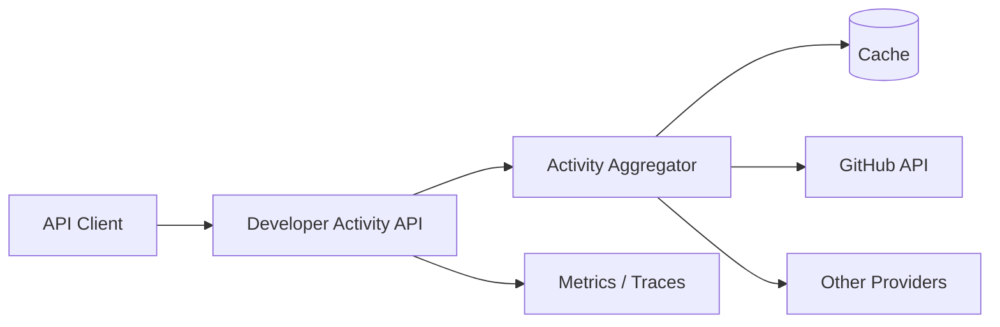

# Developer Activity

> 흩어진 개발자 활동을 하나의 API로 모으고, 외부 API 장애에도 견디는 통합 서비스


## 프로젝트 소개

GitHub 등 여러 개발 플랫폼에 흩어진 활동 데이터를 수집해 일관된 REST API로 제공하는 프로젝트입니다.

단순히 외부 API를 감싸는 데서 끝나지 않습니다. 느린 응답, 호출 제한, 일시적 장애, 부분 실패처럼 실무에서 발생하는 문제를 다루며 **Spring Boot 4와 Spring Framework 7의 기능을 깊게 학습**하는 것이 목적입니다.

```http
GET /developers/{username}
GET /developers/{username}/repositories?page=1&size=20
GET /developers/{username}/activities?page=1&size=20
GET /developers/{username}/activity-summary
```

현재 GitHub 사용자 프로필, 저장소 목록, 최근 활동과 30일 활동 요약을 지원합니다. 저장소와 활동은 최근 업데이트 순으로 조회하며 `page`는 1 이상, `size`는 1~100을 허용합니다. 존재하지 않는 사용자는 `404`, GitHub API 장애는 `502`, 응답 시간 초과는 `504`의 `ProblemDetail` 응답으로 변환합니다.
프로필과 저장소 목록은 5분 동안 메모리에 캐시하며, GitHub 장애가 발생하면 최대 15분까지 오래된 캐시를 제한적으로 사용할 수 있습니다. GitHub 호출 한도 초과는 `429`로 반환합니다. 응답에는 ETag를 포함하며, 변경되지 않은 응답에는 `304`를 사용합니다.
활동 API는 최근 GitHub 활동을 페이지 단위로 제공하며, 요약 API는 최근 30일 활동을 종류와 저장소별로 집계합니다.

## 해결하려는 문제

하나의 요청을 처리하기 위해 여러 외부 API를 호출하면 다음 문제가 생깁니다.

- 일부 외부 API만 실패했을 때 전체 요청을 실패시켜야 하는가?
- 응답이 느린 서비스는 언제 포기해야 하는가?
- 재시도가 장애를 더 악화시키지 않게 하려면 어떻게 해야 하는가?
- Rate Limit을 소진하지 않으면서 최신 데이터를 제공하려면 어떻게 해야 하는가?
- API 응답 규격을 변경하면서 기존 클라이언트를 어떻게 보호할 것인가?
- 사용자 입력을 기반으로 한 외부 호출에서 SSRF를 어떻게 차단할 것인가?

이 프로젝트는 이러한 질문에 코드와 테스트로 답하는 것을 목표로 합니다.

## 학습 목표

- Spring HTTP Interface 기반 외부 API 클라이언트
- Spring Framework 7의 API Versioning
- `@Retryable`, `@ConcurrencyLimit`를 활용한 회복 탄력성
- timeout, retry, fallback 정책 설계
- `ProblemDetail` 기반 일관된 오류 응답
- Jackson 3 직렬화 및 커스터마이징
- 캐시, ETag, 조건부 요청과 Rate Limit 대응
- Micrometer와 OpenTelemetry 기반 관측성
- WireMock을 활용한 외부 API 장애 재현
- Testcontainers 기반 통합 테스트

## 목표 구조



복잡한 분산 시스템을 먼저 만들지 않습니다. 동작하는 단일 애플리케이션에서 출발해 필요한 기능을 검증하며 확장합니다.

## 기술 스택

### 현재 적용

- Java 21
- Spring Boot 4.1.0
- Spring Web MVC
- Spring HTTP Interface / RestClient
- Jackson 3
- Bean Validation
- Spring Boot Actuator
- Lombok
- Gradle 9.5.1
- JUnit Platform

### 필요할 때 도입

- PostgreSQL
- Redis
- WireMock
- Testcontainers
- Micrometer / OpenTelemetry

## 개발 단계

1. **완료:** GitHub 사용자 조회 API와 HTTP Interface 클라이언트 구현
2. **완료:** 페이지네이션을 지원하는 GitHub 저장소 조회
3. **완료:** 설정 가능한 외부 API timeout과 `504` 응답 처리
4. **완료:** 캐시·ETag·Rate Limit 처리
5. API 버전 관리와 `ProblemDetail` 오류 규격 적용
6. **완료:** 캐시·GitHub 호출 Micrometer 지표와 Actuator `/metrics` 노출
7. **완료:** 개발자 활동 목록과 최근 30일 활동 요약
8. 필요성이 검증된 저장소와 추가 Provider 도입

## 실행 방법

### 요구 사항

- JDK 21

별도 Gradle 설치는 필요하지 않습니다.

GitHub 토큰은 선택 사항입니다. 토큰을 사용하면 GitHub API의 인증된 요청 한도가 적용됩니다. 토큰은 설정 파일에 기록하지 않고 환경변수로 전달합니다.

```powershell
$env:GITHUB_TOKEN="your-token"
.\gradlew.bat bootRun
```

토큰 없이 실행하려면 환경변수를 설정하지 않은 상태로 애플리케이션을 실행하면 됩니다.

외부 HTTP 클라이언트에는 Spring Boot의 공통 timeout 설정을 적용합니다.

```properties
spring.http.clients.connect-timeout=2s
spring.http.clients.read-timeout=5s
```

GitHub가 제한 시간 안에 응답하지 않으면 `504 Gateway Timeout`을 반환합니다. timeout이 아닌 연결 장애와 GitHub의 기타 오류는 `502 Bad Gateway`로 반환합니다. 두 값은 `SPRING_HTTP_CLIENTS_CONNECT_TIMEOUT`, `SPRING_HTTP_CLIENTS_READ_TIMEOUT` 환경변수로 재정의할 수 있습니다.

```bash
# Windows
./gradlew.bat bootRun

# macOS / Linux
./gradlew bootRun
```

저장소 조회 예시:

```bash
curl "http://localhost:8080/developers/octocat/repositories?page=1&size=20"
```

기본 테스트 실행:

```bash
# Windows
./gradlew.bat test

# macOS / Linux
./gradlew test
```

Actuator가 활성화되어 있으므로 애플리케이션 실행 후 상태와 관측 지표를 확인할 수 있습니다.

```http
GET http://localhost:8080/actuator/health
GET http://localhost:8080/actuator/metrics/developer.cache.hits
GET http://localhost:8080/actuator/metrics/developer.cache.stale
GET http://localhost:8080/actuator/metrics/developer.github.calls
```

캐시 적중은 `developer.cache.hits`, 장애 시 오래된 캐시 사용은 `developer.cache.stale`로 셉니다. GitHub 호출은 `developer.github.calls` 타이머이며 `outcome` 태그는 `success`, `timeout`, `not_found`, `rate_limited`, `unavailable`입니다.

앱 프로세스 안의 숫자는 재시작되면 사라집니다. 시간에 쌓으려면 Prometheus가 `/actuator/prometheus`를 긁게 합니다.

```http
GET http://localhost:8080/actuator/prometheus
```

앱을 8080에 띄운 뒤:

```bash
docker compose up -d
```

Prometheus UI는 `http://localhost:9090`입니다. 스크랩 이름은 `developer_cache_hits_total`, `developer_github_calls_seconds_count`입니다.

## 문서

- [설계 결정 기록](docs/decisions.md): 주요 기술 선택의 배경, 결과, 재검토 조건

## 원칙

- 실패 시나리오를 먼저 정의하고 테스트한다.
- 기술은 필요가 생겼을 때만 추가한다.
- 외부 시스템의 장애를 내부 장애로 무조건 전파하지 않는다.
- 캐시된 데이터와 최신 데이터를 명확히 구분한다.
- 관측할 수 없는 회복 탄력성은 구현하지 않은 것으로 간주한다.
