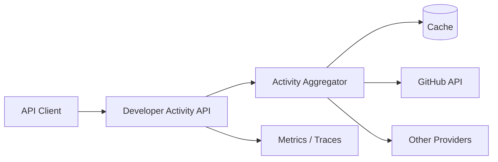

# Developer Activity

> 흩어진 개발자 활동을 하나의 API로 모으고, 외부 API 장애에도 견디는 통합 서비스


## 프로젝트 소개

GitHub 등 여러 개발 플랫폼에 흩어진 활동 데이터를 수집해 일관된 REST API로 제공하는 프로젝트입니다.

단순히 외부 API를 감싸는 데서 끝나지 않습니다. 느린 응답, 호출 제한, 일시적 장애, 부분 실패처럼 실무에서 발생하는 문제를 다루며 **Spring Boot 4와 Spring Framework 7의 기능을 깊게 학습**하는 것이 목적입니다.

```http
GET /developers/{username}/summary
GET /developers/{username}/repositories
GET /developers/{username}/activity
GET /developers/{username}/languages
```

> 현재는 Spring Initializr 기반의 프로젝트 골격만 구성된 상태입니다. 위 API는 개발 목표이며 아직 구현되지 않았습니다.

## 해결하려는 문제

하나의 요청을 처리하기 위해 여러 외부 API를 호출하면 다음 문제가 생깁니다.

- 일부 외부 API만 실패했을 때 전체 요청을 실패시켜야 하는가?
- 응답이 느린 서비스는 언제 포기해야 하는가?
- 재시도가 장애를 더 악화시키지 않게 하려면 어떻게 해야 하는가?
- Rate Limit을 소진하지 않으면서 최신 데이터를 제공하려면 어떻게 해야 하는가?
- API 응답 규격을 변경하면서 기존 클라이언트를 어떻게 보호할 것인가?
- 사용자 입력을 기반으로 한 외부 호출에서 SSRF를 어떻게 차단할 것인가?

이 프로젝트는 이러한 질문에 코드와 테스트로 답하는 것을 목표로 합니다.

## 학습 목표

- Spring HTTP Interface 기반 외부 API 클라이언트
- Spring Framework 7의 API Versioning
- `@Retryable`, `@ConcurrencyLimit`를 활용한 회복 탄력성
- timeout, retry, fallback 정책 설계
- `ProblemDetail` 기반 일관된 오류 응답
- Jackson 3 직렬화 및 커스터마이징
- 캐시, ETag, 조건부 요청과 Rate Limit 대응
- Micrometer와 OpenTelemetry 기반 관측성
- WireMock을 활용한 외부 API 장애 재현
- Testcontainers 기반 통합 테스트

## 목표 구조



복잡한 분산 시스템을 먼저 만들지 않습니다. 동작하는 단일 애플리케이션에서 출발해 필요한 기능을 검증하며 확장합니다.

## 기술 스택

### 현재 적용

- Java 21
- Spring Boot 4.1.0
- Spring Web MVC
- Bean Validation
- Spring Boot Actuator
- Lombok
- Gradle 9.5.1
- JUnit Platform

### 필요할 때 도입

- PostgreSQL
- Redis
- WireMock
- Testcontainers
- Micrometer / OpenTelemetry

## 개발 단계

1. GitHub 사용자·저장소 조회 API 구현
2. HTTP Interface 기반 외부 API 클라이언트 분리
3. timeout·retry·부분 실패 정책과 테스트 작성
4. 캐시·ETag·Rate Limit 처리
5. API 버전 관리와 `ProblemDetail` 오류 규격 적용
6. 메트릭·트레이싱을 통한 외부 호출 관측
7. 필요성이 검증된 저장소와 추가 Provider 도입

## 실행 방법

### 요구 사항

- JDK 21

별도 Gradle 설치는 필요하지 않습니다.

```bash
# Windows
./gradlew.bat bootRun

# macOS / Linux
./gradlew bootRun
```

기본 테스트 실행:

```bash
# Windows
./gradlew.bat test

# macOS / Linux
./gradlew test
```

Actuator가 활성화되어 있으므로 애플리케이션 실행 후 상태를 확인할 수 있습니다.

```http
GET http://localhost:8080/actuator/health
```

## 원칙

- 실패 시나리오를 먼저 정의하고 테스트한다.
- 기술은 필요가 생겼을 때만 추가한다.
- 외부 시스템의 장애를 내부 장애로 무조건 전파하지 않는다.
- 캐시된 데이터와 최신 데이터를 명확히 구분한다.
- 관측할 수 없는 회복 탄력성은 구현하지 않은 것으로 간주한다.
