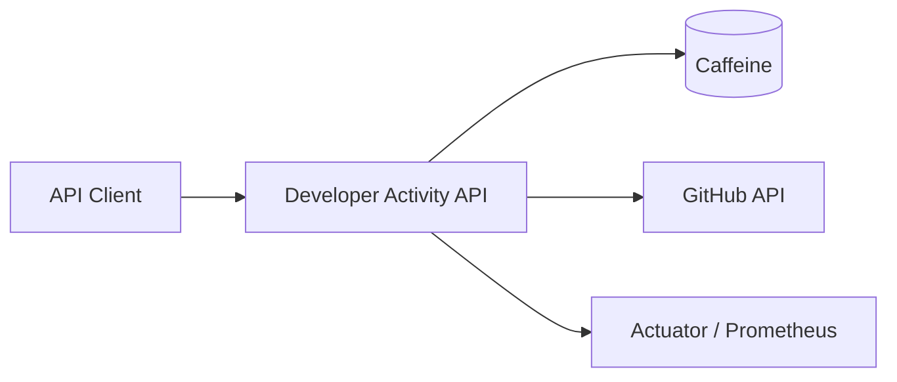

# Developer Activity

> GitHub 사용자 조회 하나에 timeout·캐시·한도·관측을 얹는 Spring Boot 연습장


## 무엇을 하는가

GitHub username을 받아 프로필·저장소·최근 활동·30일 요약을 REST로 돌려준다. 제품이 아니라 **외부 API 장애를 Spring Boot 4에서 다루는 연습**이다. 두 번째 Provider, Redis, DB는 아직 없다.

```http
GET /developers/{username}
GET /developers/{username}/repositories?page=1&size=20
GET /developers/{username}/activities?page=1&size=20
GET /developers/{username}/activity-summary
```

- `page`는 1 이상, `size`는 1~100. 저장소·활동은 최근 업데이트 순.
- 없는 사용자 `404`, GitHub 장애 `502`, 시간 초과 `504`, 호출 한도 `429`. 본문은 `ProblemDetail`.
- 프로필·저장소는 5분 메모리 캐시. GitHub가 죽으면 최대 15분 오래된 값을 쓸 수 있다.
- 응답에 ETag. 그대로면 `304`.

## 지금 다루는 질문

- 느린 GitHub는 언제 포기하는가? (2s connect / 5s read → `504`)
- 한도를 깎지 않고 같은 조회를 되풀이하려면? (캐시·ETag)
- 한도를 넘기면 호출자에게 어떻게 알리는가? (`429`)
- 캐시 적중·스테일·실제 호출을 어떻게 보는가? (Actuator + Prometheus)

아직 안 한 것: API 버전, 재시도, 두 번째 Provider, Redis/DB, OpenTelemetry.

## 구조



## 기술 스택

**현재:** Java 21, Spring Boot 4.1.0, Web MVC, HTTP Interface / RestClient, Jackson 3, Bean Validation, Caffeine, Actuator, Micrometer, Prometheus registry, Lombok, Gradle 9.5.1, JUnit.

**필요할 때만:** API 버전, `@Retryable`, OpenTelemetry, WireMock, Testcontainers, Redis, PostgreSQL.

## 개발 단계

1. **완료:** GitHub 사용자 조회와 HTTP Interface 클라이언트
2. **완료:** 페이지네이션 저장소 조회
3. **완료:** timeout과 `504`
4. **완료:** 캐시·ETag·Rate Limit
5. **완료:** `ProblemDetail` (`404` / `429` / `502` / `504`)
6. **완료:** Micrometer 지표와 `/actuator/metrics`
7. **완료:** `/actuator/prometheus`와 로컬 Prometheus compose
8. **완료:** 활동 목록과 30일 요약
9. 보류: API 버전, 재시도, 추가 Provider — 지표가 필요를 보여 줄 때

## 실행

JDK 21. Gradle은 래퍼를 쓴다. `GITHUB_TOKEN`은 선택. 있으면 인증 한도가 적용된다. 파일에 넣지 말고 환경변수로만 준다.

```bash
# macOS / Linux
export GITHUB_TOKEN=your-token   # 생략 가능
./gradlew bootRun

# Windows
set GITHUB_TOKEN=your-token
gradlew.bat bootRun
```

```bash
curl "http://localhost:8080/developers/octocat/repositories?page=1&size=20"
./gradlew test
```

Timeout은 `spring.http.clients.connect-timeout=2s`, `read-timeout=5s`. 환경변수 `SPRING_HTTP_CLIENTS_CONNECT_TIMEOUT`, `SPRING_HTTP_CLIENTS_READ_TIMEOUT`으로 바꿀 수 있다.

### 관측

프로세스 스냅샷:

```http
GET http://localhost:8080/actuator/health
GET http://localhost:8080/actuator/metrics/developer.cache.hits
GET http://localhost:8080/actuator/metrics/developer.cache.stale
GET http://localhost:8080/actuator/metrics/developer.github.calls
```

`developer.github.calls`의 `outcome`은 `success` | `timeout` | `not_found` | `rate_limited` | `unavailable`. 앱을 끄면 숫자는 사라진다.

시간에 쌓으려면 앱을 8080에 둔 채:

```bash
docker compose up -d
```

`GET /actuator/prometheus`를 5초마다 긁는다. UI는 http://localhost:9090. 시계열 이름은 `developer_cache_hits_total`, `developer_github_calls_seconds_count`.

## 문서

- [설계 결정 기록](docs/decisions.md)

## 원칙

- 실패 시나리오를 먼저 정의하고 테스트한다.
- 기술은 필요가 생겼을 때만 추가한다.
- 외부 시스템의 장애를 내부 장애로 무조건 전파하지 않는다.
- 캐시된 데이터와 최신 데이터를 명확히 구분한다.
- 관측할 수 없는 회복 탄력성은 구현하지 않은 것으로 간주한다.
